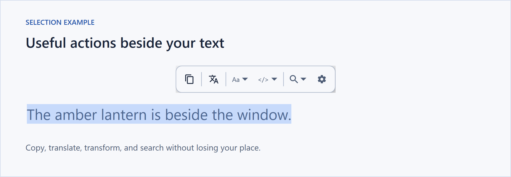
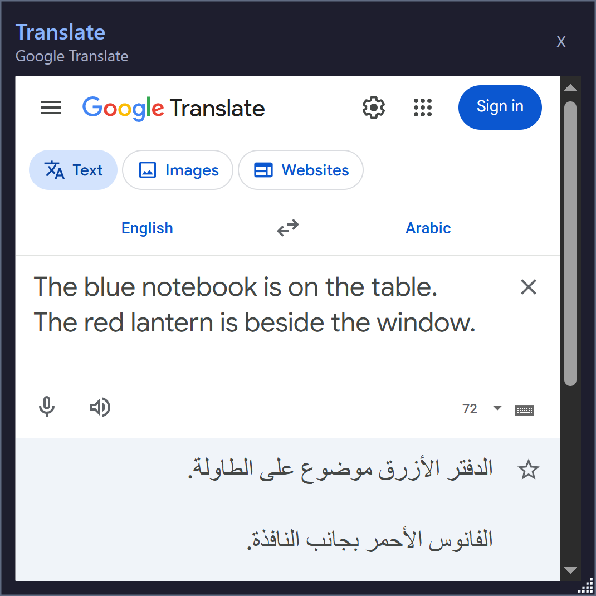
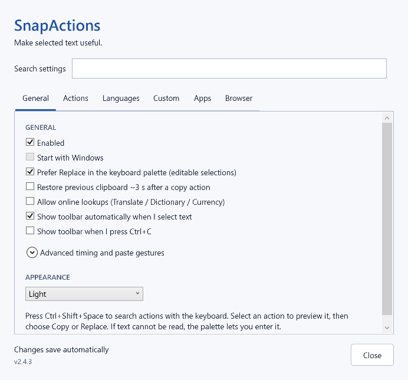

# SnapActions

**Useful actions, right where you select text.**

SnapActions is a free, open-source toolbar for Windows. Highlight text to translate it, search the web, clean up writing, format code or convert a value. Results and previews stay close to your selection.

[Download for Windows](https://github.com/roko-tech/SnapActions/releases/latest) · [User guide](docs/user-guide.md) · [Browser setup](browser-extension/README.md) · [Release notes](https://github.com/roko-tech/SnapActions/releases)



## Get started

1. Download the latest **win-x64 ZIP** and extract it to a permanent folder.
2. Keep `SnapActions.exe` and its accompanying files together, then run the executable.
3. Select some text and choose an action from the toolbar.

Requires **64-bit Windows 10 (build 19041 or later) or Windows 11**. The .NET runtime is included; there is no installer or account to set up. Double-click the tray icon to open Settings.

Inline translation also requires the [Microsoft Edge WebView2 Runtime](https://developer.microsoft.com/en-us/microsoft-edge/webview2/#download-section). If it is missing, install Microsoft's **Evergreen Runtime**.

For Brave, Chrome or Edge, add the optional [browser companion](browser-extension/README.md). It reads the browser's selected text directly, including mixed Arabic/English and selections across lines. **Settings → Browser** contains the setup controls and connection status.

To update, exit SnapActions from its tray menu and replace the application files with the new ZIP's contents. Your settings are kept separately. Reload the browser companion after updating its files, and register it again if you move the executable.

## Select, preview, act

| Select… | Then… |
| --- | --- |
| A sentence | Translate in a popup, change case or search |
| An English word | Look up its definition inline |
| `2 + 3 * 4` or `5 ft` | Calculate or convert units |
| `$33` or `100 SAR` | Convert currency inline |
| A link | Open it or remove tracking parameters |
| JSON, XML or encoded text | Format, minify, encode or decode |
| `#89B4FA` | Preview the color and convert its format |

Hover a toolbar action for a preview. Text transforms show **Copy result** and, when the original selection can be verified as editable, **Replace selection**. The [user guide](docs/user-guide.md#what-it-detects) lists the other supported text types and actions.

Prefer the keyboard? Press **Ctrl+Shift+Space**, search for an action, and use **↑ / ↓**, **Enter** and **Esc**. You can enter text in the palette if the application does not expose its selection.

## Translate without leaving your work

**Translate** opens Google Translate inside a SnapActions popup, with your selected text and saved language choices ready to use. Edit the text, change or swap languages, and copy the result using Google's controls. Translation stays in the popup without opening a browser tab.

Use **Detect language** to choose the source automatically. Language choices supported by SnapActions are remembered for the next selection. The compact popup can be resized from its lower-right corner; scroll inside it for longer text.



Translation needs an internet connection and Google's website to be available; no paid API or account configuration is required. The popup has its own **Close** control and offers **Retry** if the page cannot load.

Translate, Dictionary and Currency ask for permission on first use. You can turn them off with **Allow online lookups** in Settings. English definitions use dictionaryapi.dev and currency rates use open.er-api.com. See [lookup details](docs/user-guide.md#inline-popups).

## Make it yours

- **Pin and reorder:** drag actions from a menu onto the toolbar, then arrange them as you like.
- **Keep it tidy:** right-click to hide or unpin actions. The toolbar gear restores hidden ones.
- **Show more suggestions:** new settings default to **8 inline actions**. Pinned actions come first, and overflow stays in `…`.
- **Choose your workflow:** add search engines, custom actions, reusable text recipes and per-app preferences.
- **Match your desktop:** choose a light, dark or system theme.



Changes save automatically. Existing preferences are preserved when you update. See [all settings](docs/user-guide.md#customize).

## Privacy and compatibility

Automatic highlighting uses the browser companion or Windows accessibility APIs without copying text or changing your clipboard. Detection, formatting, transforms and local conversions run on your PC. SnapActions itself has no telemetry or automatic updater.

Online translation sends the selected text and languages to Google; dictionary lookup sends the word to dictionaryapi.dev. Currency lookup sends only the source currency code to open.er-api.com. Search, IP lookup and URL actions open the chosen destination in your browser. Custom fetch actions contact the service you configure. [Privacy details](docs/user-guide.md#privacy)

The translation popup uses its own **InPrivate** profile, separate from your regular browser.

Some applications and browser pages do not expose usable selections. For those, enable **Show toolbar when I press Ctrl+C** and copy explicitly. Password managers are excluded by default. [Capture behavior and known limits](docs/user-guide.md#how-it-works)

## Build and contribute

SnapActions uses C# and WPF. Build on Windows with the .NET SDK pinned in [`global.json`](global.json):

```powershell
dotnet build SnapActions/SnapActions.csproj -c Release
dotnet test SnapActions.Tests/SnapActions.Tests.csproj -c Release
```

For a complete package, including browser tests and compiled UI checks, run `python tools/package.py`. See the [development reference](docs/user-guide.md#build-from-source) for Node/Python requirements, isolated test instances and validation details.

[Report an issue](https://github.com/roko-tech/SnapActions/issues) · [CI](https://github.com/roko-tech/SnapActions/actions/workflows/build.yml) · [MIT license](LICENSE) · [Bundled licenses](licenses/README.md)
